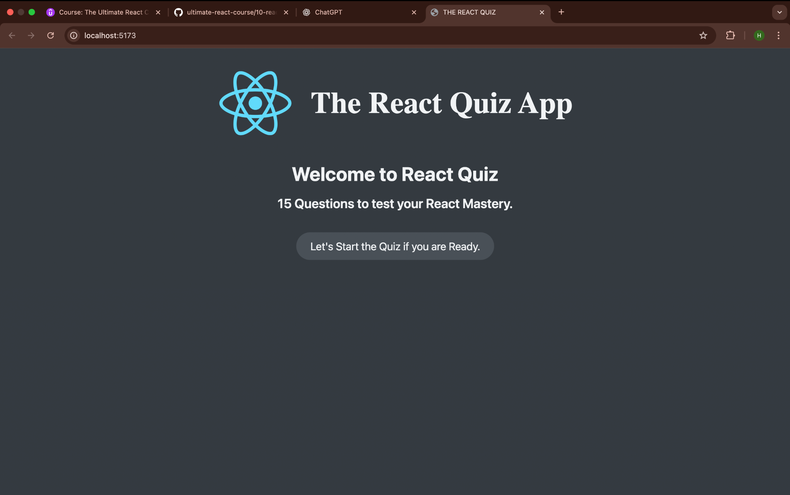
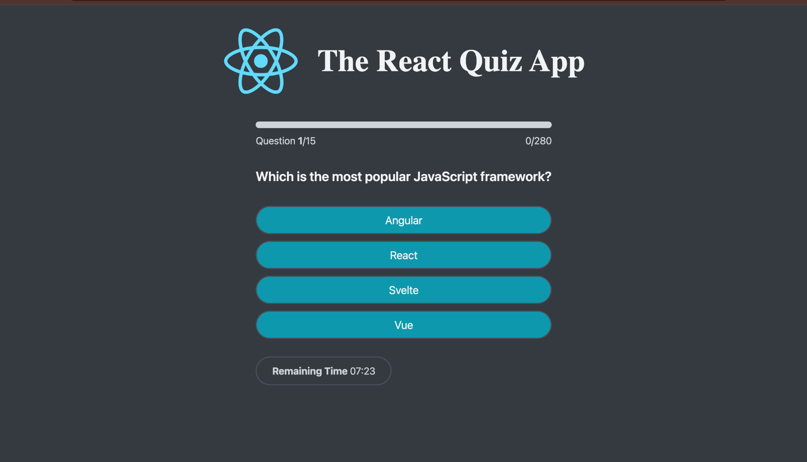
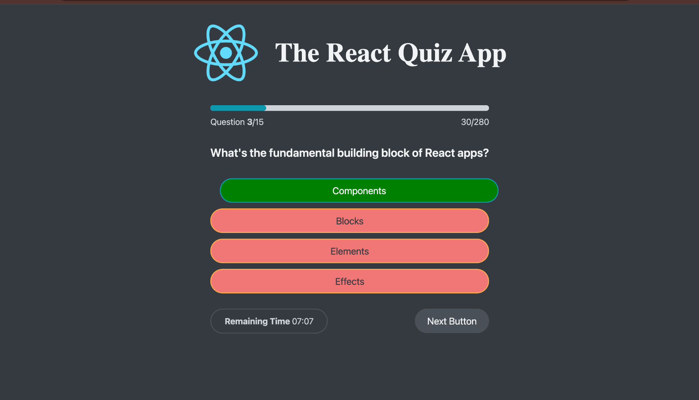
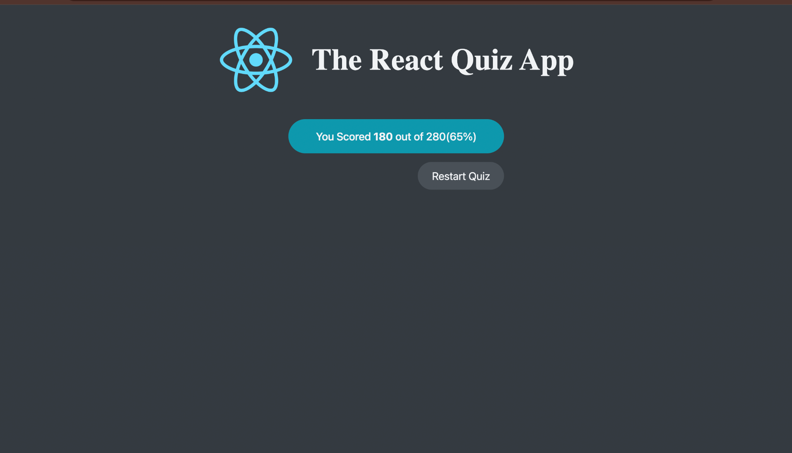

# ⚛️ The React Quiz App

An **interactive quiz application** built with **React + Vite** using the `useReducer` hook for state management.  
It fetches quiz questions from a **local JSON server** and features a built-in **timer** for added challenge.

---

## 🚀 Features

| Feature | Description |
|---------|-------------|
| ⚡ **Fast Rendering** | Built with React + Vite for lightning-fast performance |
| 🧠 **State Management with `useReducer`** | Manages quiz state, score, and timer in one place |
| 🌐 **JSON Server Integration** | Serves quiz data from a local REST API |
| ⏳ **Countdown Timer** | Keeps the quiz exciting and challenging |
| 📊 **Progress Bar** | Displays question progress visually |
| 📱 **Responsive Design** | Works on mobile, tablet, and desktop |

---

## 📸 Screenshots

**Start Screen**

**Quiz in Progress**

**Answer Feedback**

**Finish Screen**

---
---
